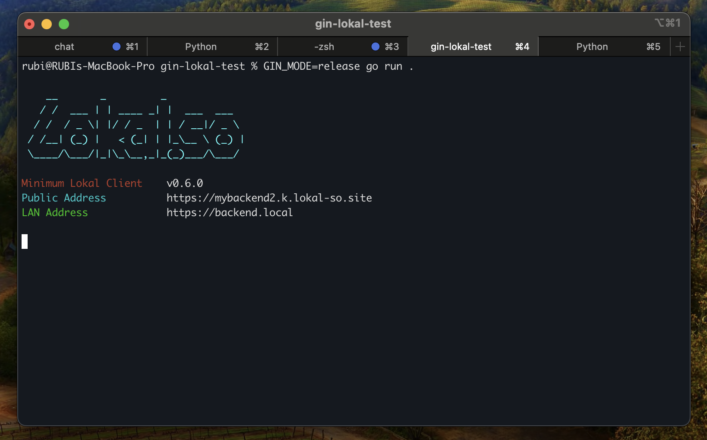

# Lokal Go

Library to interact with Lokal Client REST API



```go
lkl, err := lokal.NewDefault()
if err != nil {
    panic(err)
}

tun, err := lkl.NewTunnel().
    SetName("Gin test").
    SetTunnelType(lokal.TunnelTypeHTTP).
    SetPublicAddress("mybackend2.k.lokal-so.site").
    SetLANAddress("backend.local").
    SetLocalAddress(address).
    ShowStartupBanner().
    IgnoreDuplicate().
    Create()
if err != nil {
    panic(err)
}

// fmt.Println(tun.GetPublicAddress())
```
